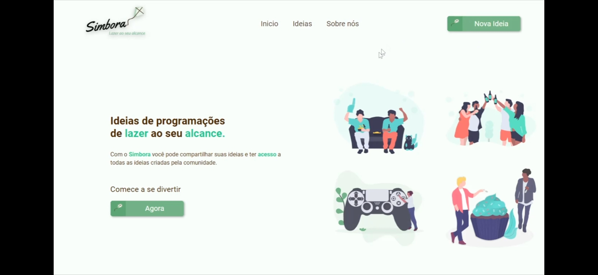
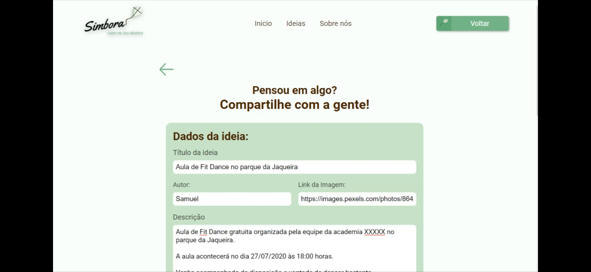

## Simbora :rocket:

Repositório responsável por armazenar o Projeto do Simbora desenvolvido durante a cadeira de Projeto Inegrador da Faculdade Senac PE. O Simbora é uma plataforma para cadastro e divulgação de atividades de lazer gratuitas. Essas atividades podem ser cadastradas como remotas (que podem ser acessadas de qualquer lugar) ou locais (que estão bem próximas de você).

## Tecnologias utilizadas :computer:

- Front-End: React
- Back-End: NodeJS, SQlite3

## Como rodar :fire:

1. Clone o repositório
1. Execute o comando Yarn para adicionar todas as extensões
1. Rode o comando `npm run dev` na pasta `Back` para iniciar o servidor
1. Rode o comando `yarn start` na pasta `frontend/simbora` para iniciar o front-end

#### Com amor :heart: Samuel Santos
